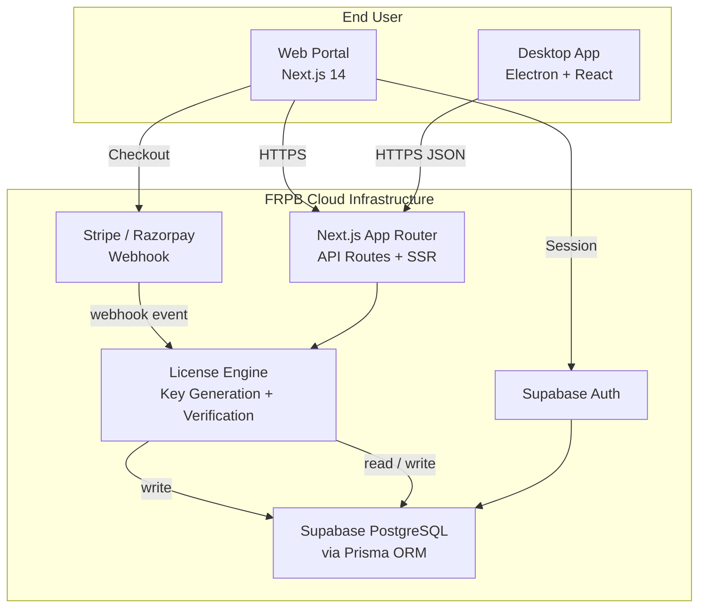
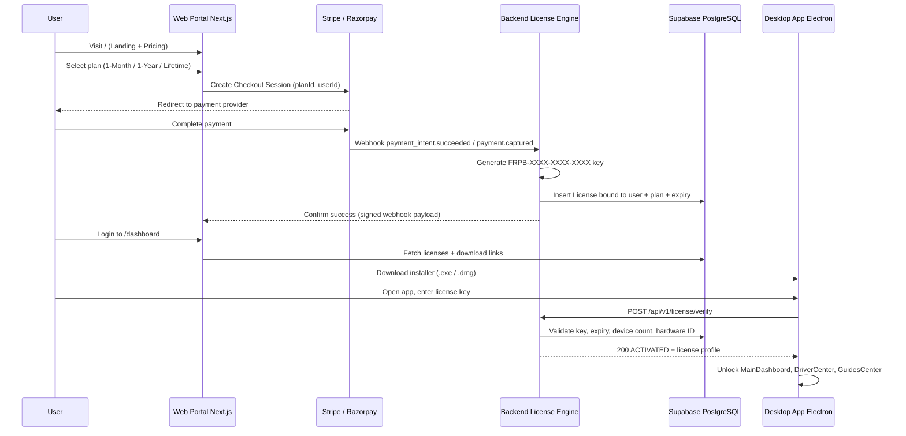
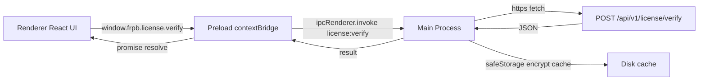

# FRPB — System Architecture & Full-Stack Blueprint

**Project:** FRPB (Device Management & Recovery SaaS Platform)
**Mode:** System Architecture & Full-Stack Blueprint Design
**Role:** Principal System Architect & Full-Stack Lead Engineer
**Version:** 1.0

---

## 1. System Overview

FRPB is a two-tier commercial SaaS platform for device management, utility tooling, and guided recovery.



### Key Architectural Decisions (Confirmed)

| Decision | Choice | Rationale |
|---|---|---|
| License enforcement | **Online-only** | Every launch requires `POST /api/v1/license/verify`; no offline caching. Simplest, most piracy-resistant. |
| Auth + Database | **Supabase Auth + Supabase PostgreSQL** | Single provider for auth and DB; Prisma ORM on top. |
| Driver delivery | **Direct OEM official URLs** | DriverCenter opens Samsung / MTK / Qualcomm official pages. Zero hosting cost. |
| Monorepo | **pnpm workspaces** | Shared types + hooks between Web and Desktop. |
| Payment | **Stripe + Razorpay** | Dual-provider webhook abstraction via a single payment gateway interface. |

---

## 2. Core Business & Technical Workflow



---

## 3. Monorepo Folder Directory Tree

```
frpb/
├── package.json                      # pnpm workspaces root
├── pnpm-workspace.yaml
├── turbo.json                        # Turborepo pipeline (build/dev/lint)
├── tsconfig.base.json
├── .env.example                      # Shared env template (DB URL, JWT secret, webhook secrets)
├── README.md
│
├── apps/
│   ├── web/                          # Next.js 14 SaaS Web Portal
│   │   ├── package.json
│   │   ├── next.config.mjs
│   │   ├── tailwind.config.ts
│   │   ├── postcss.config.mjs
│   │   ├── middleware.ts             # Supabase session guard for /dashboard
│   │   └── src/
│   │       ├── app/
│   │       │   ├── layout.tsx
│   │       │   ├── page.tsx          # /  Landing (Hero, Icons, Features, Pricing, EULA)
│   │       │   ├── globals.css
│   │       │   ├── pricing/page.tsx  # /pricing  (optional standalone)
│   │       │   ├── auth/
│   │       │   │   ├── login/page.tsx
│   │       │   │   └── callback/route.ts
│   │       │   ├── dashboard/
│   │       │   │   ├── layout.tsx    # Requires Supabase session
│   │       │   │   └── page.tsx      # License keys table, expiry, device limit, downloads
│   │       │   └── api/
│   │       │       ├── v1/
│   │       │       │   ├── license/
│   │       │       │   │   ├── generate/route.ts   # Internal, webhook-triggered
│   │       │       │   │   ├── verify/route.ts     # External, used by Desktop App
│   │       │       │   │   ├── list/route.ts       # Dashboard license list (session-auth)
│   │       │       │   │   └── unbind/route.ts     # Self-service HWID reset (30-day cooldown)
│   │       │       │   ├── checkout/route.ts       # Create Stripe/Razorpay session
│   │       │       │   ├── webhooks/
│   │       │       │   │   ├── stripe/route.ts
│   │       │       │   │   └── razorpay/route.ts
│   │       │       │   └── health/route.ts
│   │       ├── components/
│   │       │   ├── landing/          # Hero, FeatureGrid, PricingCard, EulaDisclaimer
│   │       │   ├── dashboard/        # LicenseTable, DeviceLimitTracker, DownloadCard, DeviceManager
│   │       │   └── ui/               # Button, Badge, Card, Spinner (shadcn-style)
│   │       ├── lib/
│   │       │   ├── prisma.ts         # PrismaClient singleton
│   │       │   ├── supabase/
│   │       │   │   ├── client.ts     # Browser client
│   │       │   │   └── server.ts     # Server client (createServerClient)
│   │       │   ├── license/
│   │       │   │   ├── generate.ts   # Key generation + checksum
│   │       │   │   ├── verify.ts     # Verification business logic
│   │       │   │   └── constants.ts  # Plans, device limits, validity windows
│   │       │   ├── payments/
│   │       │   │   ├── gateway.ts    # PaymentGateway interface
│   │       │   │   ├── stripe.ts     # Stripe adapter
│   │       │   │   └── razorpay.ts   # Razorpay adapter
│   │       │   ├── email/
│   │       │   │   ├── resend.ts     # Resend adapter (transactional emails)
│   │       │   │   └── templates.ts  # License key + download links email template
│   │       │   └── rate-limit.ts     # Upstash Redis / Vercel KV sliding window + lockout
│   │       └── types/
│   │           ├── license.ts
│   │           ├── payment.ts
│   │           └── api.ts            # Shared API response envelope
│   │
│   └── desktop/                      # Electron.js Desktop App
│       ├── package.json              # main: dist-electron/main.js
│       ├── electron-builder.yml      # .exe (nsis) + .dmg (dmg) targets + publish config
│       ├── tsconfig.json
│       ├── tailwind.config.ts
│       ├── vite.config.ts            # React renderer via Vite
│       ├── index.html
│       ├── electron/
│       │   ├── main.ts               # Main process entry
│       │   ├── preload.ts            # contextBridge IPC surface
│       │   ├── ipc/
│       │   │   ├── license.ts        # handle('license:verify') etc.
│       │   │   ├── device.ts         # handle('device:status') USB polling + driver detection
│       │   │   ├── links.ts          # handle('links:openExternal') OEM URLs
│       │   │   └── updater.ts        # handle('updater:check') electron-updater
│       │   └── utils/
│       │       ├── hardwareId.ts     # Stable machine fingerprint (HKLM/machine-id)
│       │       ├── secureStore.ts    # safeStorage-encrypted license cache (metadata only)
│       │       ├── usb.ts            # node-usb device polling + vendor mapping
│       │       └── logger.ts
│       └── src/
│           ├── main.tsx              # React renderer bootstrap
│           ├── App.tsx               # Route gate: ActivationScreen <-> MainDashboard
│           ├── components/
│           │   ├── ActivationScreen.tsx
│           │   ├── MainDashboard.tsx
│           │   ├── DriverCenter.tsx
│           │   ├── GuidesCenter.tsx
│           │   ├── DeviceMonitor.tsx # USB state card: searching / connected / missing drivers
│           │   └── UpdateModal.tsx   # 1-click "Update Now" modal
│           ├── hooks/
│           │   ├── useLicense.ts     # Calls window.frpb.license.verify
│           │   ├── useDeviceStatus.ts# Polls window.frpb.device.status
│           │   ├── useUpdater.ts     # Subscribes to updater:status events
│           │   └── useGuides.ts
│           ├── lib/
│           │   └── ipc.d.ts          # Typed window.frpb bridge declarations
│           └── styles/globals.css
│
└── packages/
    ├── shared/                       # Shared types + validation (zod schemas)
    │   ├── package.json
    │   ├── src/
    │   │   ├── index.ts
    │   │   ├── license.ts            # LicenseStatus, LicenseProfile, VerifyRequest z-schema
    │   │   ├── plans.ts              # Plan definitions shared by web + desktop
    │   │   └── api.ts                # ApiResponse<T> envelope types
    │   └── tsconfig.json
    └── eslint-config/                # Shared ESLint config
        ├── package.json
        └── index.js
```

---

## 4. Database Schema (`prisma/schema.prisma`)

Design notes:

- **License device limit**: `deviceLimit` (1 for 1-Month, 3 for 1-Year, 5 for Lifetime by default) — configurable in [`packages/shared/src/plans.ts`](../packages/shared/src/plans.ts).
- **Hardware binding**: `LicenseDevice` rows store `hardwareId` + `deviceName`; verification registers new devices up to `deviceLimit`.
- **Online-only enforcement**: `lastVerifiedAt` is written on every successful `/verify` call; `isActive` derived from `status` + `expiresAt`.
- **Payments**: both Stripe and Razorpay normalized into one `Payment` model via a `provider` enum.

```prisma
// prisma/schema.prisma

generator client {
  provider = "prisma-client-js"
}

datasource db {
  provider = "postgresql"
  url      = env("DATABASE_URL")
}

// ─── Enums ────────────────────────────────────────────────
enum PlanType {
  MONTH_1
  YEAR_1
  LIFETIME
}

enum LicenseStatus {
  ACTIVE
  EXPIRED
  REVOKED
  PENDING
}

enum PaymentProvider {
  STRIPE
  RAZORPAY
}

enum PaymentStatus {
  PENDING
  SUCCEEDED
  FAILED
  REFUNDED
}

enum DeviceStatus {
  CONNECTED
  DISCONNECTED
  UNAUTHORIZED
}

// ─── Users ────────────────────────────────────────────────
model User {
  id            String    @id @default(cuid())
  email         String    @unique
  name          String?
  supabaseId    String?   @unique // Supabase Auth user UUID for binding
  createdAt     DateTime  @default(now())
  updatedAt     DateTime  @updatedAt

  licenses      License[]
  payments      Payment[]
}

// ─── Plans ────────────────────────────────────────────────
model Plan {
  id          String    @id @default(cuid())
  slug        PlanType  @unique
  name        String    // "1-Month Plan", "1-Year Plan", "Lifetime Plan"
  priceCents  Int
  currency    String    @default("USD")
  durationDays Int?     // null = lifetime
  deviceLimit Int       // 1 / 3 / 5
  features    String[]  // feature list displayed on pricing cards
  createdAt   DateTime  @default(now())

  licenses    License[]
}

// ─── Licenses ─────────────────────────────────────────────
model License {
  id             String        @id @default(cuid())
  key            String        @unique // "FRPB-XXXX-XXXX-XXXX"
  keySha256      String        @unique // hashed for lookup + raw stored encrypted
  userId         String
  user           User          @relation(fields: [userId], references: [id], onDelete: Cascade)
  planId         String
  plan           Plan          @relation(fields: [planId], references: [id])
  status         LicenseStatus @default(ACTIVE)
  deviceLimit    Int           // snapshot of plan.deviceLimit at purchase time
  maxActivations Int           @default(1) // 1 activation per machine at a time
  activatedAt    DateTime?
  expiresAt      DateTime?
  lastVerifiedAt DateTime?
  revokedReason  String?
  metadata       Json?         // orderId, promoCode etc.
  createdAt      DateTime      @default(now())
  updatedAt      DateTime      @updatedAt

  devices        LicenseDevice[]
  payment        Payment?
  emailLogs      EmailLog[]

  @@index([userId])
  @@index([status])
}

// ─── Hardware-bound devices ───────────────────────────────
model LicenseDevice {
  id          String       @id @default(cuid())
  licenseId   String
  license     License      @relation(fields: [licenseId], references: [id], onDelete: Cascade)
  hardwareId  String       // machine fingerprint
  deviceName  String       // hostname / OS label reported by client
  status      DeviceStatus @default(CONNECTED)
  lastSeenAt  DateTime     @default(now())
  unboundAt   DateTime?    // last time user unbound this machine (self-service reset)
  unbindCount Int          @default(0) // total unbind operations for this device
  createdAt   DateTime     @default(now())

  @@unique([licenseId, hardwareId])
  @@index([hardwareId])
}

// ─── Payments ─────────────────────────────────────────────
model Payment {
  id            String          @id @default(cuid())
  userId        String
  user          User            @relation(fields: [userId], references: [id], onDelete: Cascade)
  licenseId     String?         @unique
  license       License?        @relation(fields: [licenseId], references: [id])
  provider      PaymentProvider
  providerTxnId String          @unique // Stripe payment_intent id / Razorpay payment id
  providerEventId String?       // webhook event id for idempotency
  amountCents   Int
  currency      String          @default("USD")
  status        PaymentStatus   @default(PENDING)
  planSlug      PlanType
  createdAt     DateTime        @default(now())
  updatedAt     DateTime        @updatedAt

  @@index([userId])
  @@index([provider, providerTxnId])
}

// ─── Webhook Idempotency ─────────────────────────────────
model WebhookEvent {
  id            String   @id @default(cuid())
  provider      PaymentProvider // STRIPE or RAZORPAY
  eventId       String   @unique // provider event id (e.g., evt_..., event_...)
  eventType     String   // payment_intent.succeeded / payment.captured
  payload       Json     // raw provider payload for audit + replay
  status        String   @default("RECEIVED") // RECEIVED | PROCESSED | FAILED | IGNORED
  processedAt   DateTime?
  licenseId     String?
  error         String?  // error message if processing failed
  createdAt     DateTime @default(now())

  @@index([provider, status])
  @@index([licenseId])
}

// ─── Email Delivery Log (Resend / SendGrid) ──────────────
model EmailLog {
  id            String   @id @default(cuid())
  to            String   // recipient email
  template      String   // "license-delivered" | "quick-start"
  licenseId     String?
  license       License? @relation(fields: [licenseId], references: [id])
  providerMsgId String?  // Resend message id / SendGrid message id
  status        String   @default("QUEUED") // QUEUED | SENT | FAILED
  error         String?
  sentAt        DateTime?
  createdAt     DateTime @default(now())

  @@index([to])
  @@index([licenseId])
}
```

### Env / Secrets required

```
DATABASE_URL=postgresql://...
SUPABASE_URL=...
SUPABASE_ANON_KEY=...
SUPABASE_SERVICE_ROLE_KEY=...
STRIPE_SECRET_KEY=...
STRIPE_WEBHOOK_SECRET=...
RAZORPAY_KEY_ID=...
RAZORPAY_KEY_SECRET=...
RAZORPAY_WEBHOOK_SECRET=...
LICENSE_SIGNING_SECRET=...       # HMAC for verify responses (optional but recommended)
UPSTASH_REDIS_REST_URL=...       # rate limiting + brute-force lockout
UPSTASH_REDIS_REST_TOKEN=...     # or VERCEL_KV_* equivalents
RESEND_API_KEY=...               # transactional emails
EMAIL_FROM=no-reply@frpb.app    # sender address
DOWNLOAD_BASE_URL=https://frpb.app/downloads  # .exe / .dmg hosted installers
QUICK_START_PDF_URL=https://frpb.app/guides/frpb-quick-start.pdf
```

---

## 5. Next.js API Route — `/api/v1/license/verify`

**Contract (Desktop App → FRPB):**

```http
POST /api/v1/license/verify
Content-Type: application/json

{
  "licenseKey": "FRPB-ABCD-1234-EFGH",
  "hardwareId": "a3f1c9d2-...",        // machine fingerprint from Electron main
  "deviceName": "DESKTOP-7F3K2Q",
  "os": "win32",
  "appVersion": "1.0.0"
}
```

**Responses:**

| HTTP | Body `status` | Meaning |
|---|---|---|
| 200 | `ACTIVE` | License valid, device registered. Client unlocks UI. |
| 200 | `DEVICE_LIMIT_EXCEEDED` | Valid license but this machine is not authorized and limit reached. |
| 401 | `INVALID_KEY` | Key not found. |
| 403 | `EXPIRED` / `REVOKED` | Key known but not usable. |
| 429 | `RATE_LIMITED` | >10 req/min per IP/HWID (sliding window, §5.0). |
| 429 | `LOCKED` | 5 consecutive `INVALID_KEY` attempts — 1h brute-force ban (§5.0). |

All bodies use the shared envelope: `{ success, status, license?, message }`.

```typescript
// apps/web/src/app/api/v1/license/verify/route.ts
import { NextRequest, NextResponse } from "next/server";
import { z } from "zod";
import { PrismaClient } from "@prisma/client";
import { verifyLicenseCore } from "@/lib/license/verify";
import { rateLimit, checkLockout, recordFailure, clearFailures } from "@/lib/rate-limit";
import { VerifyRequestSchema } from "@frpb/shared";

// Route segment config: this is a public external API consumed by the desktop client
export const runtime = "nodejs";
export const dynamic = "force-dynamic";

const prisma = new PrismaClient();

// ─── Anti-fraud guard: rate limit + brute-force lockout ────────
// Sliding window:   max 10 req/min per IP AND per HWID.
// Brute-force lock: 5 consecutive failed key validations -> 1h ban
//                   (enforced per IP and per HWID).
// Storage:          Upstash Redis REST / Vercel KV (lib/rate-limit.ts).

export async function POST(req: NextRequest) {
  try {
    const body = VerifyRequestSchema.parse(await req.json());

    // 1. Client fingerprint used for throttling
    const ip = req.headers.get("x-forwarded-for")?.split(",")[0]?.trim() ?? "unknown";
    const hwid = body.hardwareId;

    // 2. Sliding-window rate limit — 10 req/min per IP and per HWID
    const [ipLimit, hwidLimit] = await Promise.all([
      rateLimit(`verify:ip:${ip}`, 10, 60),
      rateLimit(`verify:hwid:${hwid}`, 10, 60),
    ]);
    if (!ipLimit.allowed || !hwidLimit.allowed) {
      return NextResponse.json(
        { success: false, status: "RATE_LIMITED", message: "Too many requests. Try again in a minute." },
        { status: 429, headers: { "Retry-After": "60" } }
      );
    }

    // 3. Brute-force lockout check (set after 5 consecutive failures)
    const locked = await checkLockout([`verify:fail:${ip}`, `verify:fail:${hwid}`]);
    if (locked) {
      return NextResponse.json(
        { success: false, status: "LOCKED", message: "Too many failed attempts. Try again in 1 hour." },
        { status: 429, headers: { "Retry-After": "3600" } }
      );
    }

    // 4. Core verification
    const result = await verifyLicenseCore({
      prisma,
      key: body.licenseKey,
      hardwareId: hwid,
      deviceName: body.deviceName,
    });

    // 5. Failure tracking — only INVALID_KEY counts toward the lockout.
    //    A successful activation resets the counter.
    if (result.httpStatusCode === 401) {
      const { lockedNow } = await recordFailure(
        [`verify:fail:${ip}`, `verify:fail:${hwid}`],
        5,
        3600
      );
      if (lockedNow) {
        return NextResponse.json(
          { success: false, status: "LOCKED", message: "Too many failed attempts. Try again in 1 hour." },
          { status: 429, headers: { "Retry-After": "3600" } }
        );
      }
    } else if (result.httpStatusCode === 200) {
      await clearFailures([`verify:fail:${ip}`, `verify:fail:${hwid}`]);
    }

    return NextResponse.json(result.body, { status: result.httpStatusCode });
  } catch (error) {
    if (error instanceof z.ZodError) {
      return NextResponse.json(
        { success: false, status: "INVALID_REQUEST", message: "Malformed payload" },
        { status: 400 }
      );
    }
    console.error("[license/verify] unexpected error:", error);
    return NextResponse.json(
      { success: false, status: "SERVER_ERROR", message: "Internal server error" },
      { status: 500 }
    );
  }
}
```

### 5.0 Anti-Fraud Layer (`lib/rate-limit.ts`)

Rate limiting and lockout share one Redis-backed module used by all public
license endpoints. Keys are namespaced by endpoint + identity so a ban on the
verify endpoint never bleeds into other APIs.

```typescript
// apps/web/src/lib/rate-limit.ts
// Fixed-window rate limiter + brute-force lockout on Upstash Redis (REST).
// Swap base URL/token for VERCEL_KV_* if deploying on Vercel KV.
import { Redis } from "@upstash/redis";

const redis = Redis.fromEnv(); // reads UPSTASH_REDIS_REST_URL + UPSTASH_REDIS_REST_TOKEN

export interface RateLimitResult {
  allowed: boolean;
  remaining: number;
  resetAt: number; // epoch seconds when the window resets
}

// Fixed-window counter — one bucket per (key, windowStart)
export async function rateLimit(
  key: string,
  max: number,
  windowSeconds: number
): Promise<RateLimitResult> {
  const now = Math.floor(Date.now() / 1000);
  const windowStart = now - (now % windowSeconds);
  const redisKey = `rl:${key}:${windowStart}`;

  const count = await redis.incr(redisKey);
  if (count === 1) await redis.expire(redisKey, windowSeconds);

  return {
    allowed: count <= max,
    remaining: Math.max(0, max - count),
    resetAt: windowStart + windowSeconds,
  };
}

// ─── Brute-force lockout ─────────────────────────────────────────
// Consecutive INVALID_KEY responses increment a per-IP and per-HWID
// failure counter. Reaching maxFailures within the window writes a
// lockout key with a 1h TTL that blocks further verification attempts.

export async function checkLockout(keys: string[]): Promise<boolean> {
  const results = await Promise.all(keys.map((k) => redis.get(`lock:${k}`)));
  return results.some((v) => v === "1");
}

export async function recordFailure(
  keys: string[],
  maxFailures: number,
  lockoutSeconds: number
): Promise<{ lockedNow: boolean }> {
  let lockedNow = false;
  for (const k of keys) {
    const count = await redis.incr(`fail:${k}`);
    if (count === 1) await redis.expire(`fail:${k}`, lockoutSeconds);
    if (count >= maxFailures) {
      await redis.set(`lock:${k}`, "1", { ex: lockoutSeconds });
      await redis.del(`fail:${k}`); // reset counter after locking
      lockedNow = true;
    }
  }
  return { lockedNow };
}

export async function clearFailures(keys: string[]): Promise<void> {
  if (keys.length) await redis.del(...keys.map((k) => `fail:${k}`));
}
```

**Redis key map:**

| Key | TTL | Purpose |
|---|---|---|
| `rl:verify:ip:{ip}:{window}` | 60s | 10 req/min per IP |
| `rl:verify:hwid:{hwid}:{window}` | 60s | 10 req/min per machine |
| `fail:verify:{ip}` / `fail:verify:{hwid}` | 1h sliding | consecutive INVALID_KEY counter |
| `lock:verify:{ip}` / `lock:verify:{hwid}` | 1h | hard block after 5 failures |

### 5.1 Verification Core Logic (`lib/license/verify.ts`)

```typescript
// apps/web/src/lib/license/verify.ts
import { sha256 } from "@/lib/crypto/sha256"; // node:crypto helper
import { LicenseStatus } from "@prisma/client";

export interface VerifyLicenseInput {
  prisma: any;
  key: string;
  hardwareId: string;
  deviceName: string;
}

export async function verifyLicenseCore({ prisma, key, hardwareId, deviceName }: VerifyLicenseInput) {
  // 1. Normalize + hash key. Only the SHA-256 of the key is stored; the raw key
  //    is encrypted at rest and never logged.
  const normalizedKey = key.trim().toUpperCase();
  const keySha256 = sha256(normalizedKey);

  const license = await prisma.license.findUnique({
    where: { keySha256 },
    include: { plan: true, devices: true },
  });

  // 2. Key not found
  if (!license) {
    return { httpStatusCode: 401, body: { success: false, status: "INVALID_KEY", message: "Invalid license key" } };
  }

  // 3. Status gate
  if (license.status === LicenseStatus.REVOKED) {
    return { httpStatusCode: 403, body: { success: false, status: "REVOKED", message: license.revokedReason ?? "License revoked" } };
  }

  // 4. Expiry gate (lifetime plans have expiresAt = null)
  if (license.expiresAt && license.expiresAt < new Date()) {
    await prisma.license.update({ where: { id: license.id }, data: { status: LicenseStatus.EXPIRED } });
    return { httpStatusCode: 403, body: { success: false, status: "EXPIRED", message: "License expired" } };
  }

  // 5. Device binding: find existing device on this license
  let device = license.devices.find((d) => d.hardwareId === hardwareId);

  if (device) {
    // Known machine -> refresh lastSeenAt + mark connected
    await prisma.licenseDevice.update({
      where: { id: device.id },
      data: { lastSeenAt: new Date(), deviceName, status: "CONNECTED" },
    });
  } else {
    // New machine -> enforce device limit (snapshot taken at purchase time)
    if (license.devices.length >= license.deviceLimit) {
      return {
        httpStatusCode: 200,
        body: {
          success: false,
          status: "DEVICE_LIMIT_EXCEEDED",
          message: `Device limit of ${license.deviceLimit} reached for this license`,
        },
      };
    }
    device = await prisma.licenseDevice.create({
      data: { licenseId: license.id, hardwareId, deviceName, status: "CONNECTED" },
    });
  }

  // 6. Online-only enforcement: stamp every successful verification
  const updated = await prisma.license.update({
    where: { id: license.id },
    data: { lastVerifiedAt: new Date(), activatedAt: license.activatedAt ?? new Date() },
    include: { plan: true },
  });

  return {
    httpStatusCode: 200,
    body: {
      success: true,
      status: "ACTIVE",
      license: {
        key: license.key,
        plan: updated.plan.slug,
        planName: updated.plan.name,
        expiresAt: updated.expiresAt,
        deviceLimit: updated.deviceLimit,
        devicesUsed: await prisma.licenseDevice.count({ where: { licenseId: updated.id } }),
        activatedAt: updated.activatedAt,
      },
      message: "License activated",
    },
  };
}
```

---

### 5.2 HWID Reset / Self-Service Device Management (`/api/v1/license/unbind`)

Dashboard-only endpoint (Supabase session JWT). A user may unbind one registered
machine per 30 days to free a device slot — e.g., after a PC upgrade or
reinstall. The device row is **not deleted**; it is marked `UNBOUND` with an
`unboundAt` timestamp and an incremented `unbindCount`, so the machine's full
lifecycle is auditable. The next verify from that machine re-activates the same
row (see integration note below), preserving history.

```typescript
// apps/web/src/app/api/v1/license/unbind/route.ts
import { NextRequest, NextResponse } from "next/server";
import { createRouteHandlerClient } from "@supabase/auth-helpers-nextjs";
import { cookies } from "next/headers";
import { PrismaClient } from "@prisma/client";
import { z } from "zod";

export const runtime = "nodejs";
const prisma = new PrismaClient();
const COOLDOWN_DAYS = 30;

const UnbindRequestSchema = z.object({
  deviceId: z.string(), // LicenseDevice.id (cuid)
});

export async function POST(req: NextRequest) {
  // 1. Session gate — only the authenticated license owner may unbind
  const supabase = createRouteHandlerClient({ cookies });
  const { data: { user } } = await supabase.auth.getUser();
  if (!user) {
    return NextResponse.json({ success: false, message: "Unauthorized" }, { status: 401 });
  }

  // 2. Ownership check: device -> license -> owner must match session user
  const body = UnbindRequestSchema.parse(await req.json());
  const device = await prisma.licenseDevice.findUnique({
    where: { id: body.deviceId },
    include: { license: { include: { user: true } } },
  });
  if (!device || device.license.userId !== user.id) {
    return NextResponse.json({ success: false, message: "Device not found" }, { status: 404 });
  }

  // 3. 30-day cooldown gate (self-service abuse prevention)
  if (device.unboundAt) {
    const nextAllowed = new Date(device.unboundAt.getTime() + COOLDOWN_DAYS * 86_400_000);
    if (nextAllowed > new Date()) {
      return NextResponse.json(
        { success: false, message: `Unbind available after ${nextAllowed.toISOString().slice(0, 10)}` },
        { status: 429 }
      );
    }
  }

  // 4. Mark unbound (row preserved for audit; hardwareId keeps its unique slot)
  await prisma.licenseDevice.update({
    where: { id: device.id },
    data: {
      status: "UNBOUND",
      unboundAt: new Date(),
      unbindCount: { increment: 1 },
    },
  });

  return NextResponse.json({ success: true, message: "Device unbound. It can re-activate on next launch." });
}
```

**Verify core integration note** (small change to §5.1): an existing device that
is `UNBOUND` must be re-activated instead of rejected, and the device-limit check
must count only `CONNECTED` machines.

```typescript
// Inside verifyLicenseCore (§5.1), replace the device-binding block:
const activeDevices = license.devices.filter((d) => d.status !== "UNBOUND");
let device = activeDevices.find((d) => d.hardwareId === hardwareId);

if (device) {
  // Known machine (or previously unbound machine re-connecting):
  await prisma.licenseDevice.update({
    where: { id: device.id },
    data: { lastSeenAt: new Date(), deviceName, status: "CONNECTED" },
  });
} else {
  // New machine -> enforce limit against ACTIVE devices only
  if (activeDevices.length >= license.deviceLimit) {
    return {
      httpStatusCode: 200,
      body: { success: false, status: "DEVICE_LIMIT_EXCEEDED", message: `Device limit of ${license.deviceLimit} reached for this license` },
    };
  }
  device = await prisma.licenseDevice.create({
    data: { licenseId: license.id, hardwareId, deviceName, status: "CONNECTED" },
  });
}
```

**Dashboard UX (`DeviceManager.tsx`)**: renders the device table with a
per-row `Unbind` button, a countdown tooltip when cooldown is active
(`Unbind available after 2026-10-07`), and a success toast. It refetches
`/api/v1/license/list` after a successful unbind.

---

### 5.3 Webhook Idempotency Engine (`WebhookEvent`)

Stripe/Razorpay delivery is **at-least-once** — retries and replays are normal.
The `WebhookEvent` table turns that into exactly-once license generation:
the provider's unique `eventId` is the dedupe key. A duplicate event short-circuits
before any license logic runs.

```typescript
// apps/web/src/app/api/v1/webhooks/stripe/route.ts
import { NextRequest, NextResponse } from "next/server";
import Stripe from "stripe";
import { PrismaClient } from "@prisma/client";
import { processPaymentEvent } from "@/lib/webhooks/processor";

export const runtime = "nodejs";
const prisma = new PrismaClient();
const stripe = new Stripe(process.env.STRIPE_SECRET_KEY!);

export async function POST(req: NextRequest) {
  const signature = req.headers.get("stripe-signature");
  const rawBody = await req.text();

  // 1. Signature verification — reject anything not signed by Stripe
  let event: Stripe.Event;
  try {
    event = stripe.webhooks.constructEvent(rawBody, signature!, process.env.STRIPE_WEBHOOK_SECRET!);
  } catch {
    return NextResponse.json({ error: "Invalid signature" }, { status: 400 });
  }

  // 2. Idempotency gate — INSERT with the unique eventId. If the event was
  //    already seen, skip processing entirely (exactly-once semantics).
  const existing = await prisma.webhookEvent.findUnique({ where: { eventId: event.id } });
  if (existing) {
    return NextResponse.json({ received: true, duplicate: true });
  }
  await prisma.webhookEvent.create({
    data: {
      provider: "STRIPE",
      eventId: event.id,
      eventType: event.type,
      payload: event.data.object as object, // raw payload for audit + replay
    },
  });

  // 3. Only completion events grant a license
  if (event.type === "checkout.session.completed") {
    const session = event.data.object as Stripe.Checkout.Session;
    await processPaymentEvent({
      provider: "STRIPE",
      providerEventId: event.id,
      customerEmail: session.customer_details?.email ?? "",
      customerName: session.customer_details?.name,
      planSlug: session.metadata?.planSlug ?? "",
      amountPaid: session.amount_total ?? 0,
      currency: session.currency ?? "usd",
      paymentId: (session.payment_intent as string) ?? session.id,
    });
  } else {
    // Non-completion events are acknowledged but never generate licenses
    await prisma.webhookEvent.update({
      where: { eventId: event.id },
      data: { status: "IGNORED", processedAt: new Date() },
    });
  }

  return NextResponse.json({ received: true });
}
```

**Payment processor + double-guard** (`lib/webhooks/processor.ts`): even if the
webhook is replayed with a different event id, the `Payment.providerPaymentId`
unique check prevents a second license key for the same Stripe payment.

```typescript
// apps/web/src/lib/webhooks/processor.ts
import { PrismaClient } from "@prisma/client";
import { generateLicenseKey, sha256 } from "@/lib/license/generate";
import { sendLicenseEmail } from "@/lib/email/resend";

const prisma = new PrismaClient();

export async function processPaymentEvent(input: {
  provider: "STRIPE" | "RAZORPAY";
  providerEventId: string;
  customerEmail: string;
  customerName?: string;
  planSlug: string;
  amountPaid: number;
  currency: string;
  paymentId: string;
}) {
  // State machine on the WebhookEvent row (auditable + recoverable)
  await prisma.webhookEvent.update({
    where: { eventId: input.providerEventId },
    data: { status: "PROCESSING" },
  });

  try {
    // 1. Find or create customer (Supabase Auth user by email)
    const user = await prisma.user.upsert({
      where: { email: input.customerEmail },
      create: { email: input.customerEmail, name: input.customerName },
      update: { name: input.customerName ?? undefined },
    });

    // 2. Resolve plan
    const plan = await prisma.plan.findUnique({ where: { slug: input.planSlug } });
    if (!plan) throw new Error(`Unknown plan: ${input.planSlug}`);

    // 3. Double-guard: a license already created for this payment? (idempotent)
    const paidPayment = await prisma.payment.findUnique({
      where: { providerPaymentId: input.paymentId },
      include: { license: true },
    });
    if (paidPayment?.license) {
      await sendLicenseEmail(paidPayment.license, input.customerEmail); // safe re-send
      await prisma.webhookEvent.update({
        where: { eventId: input.providerEventId },
        data: { status: "PROCESSED", processedAt: new Date(), licenseId: paidPayment.license.id },
      });
      return;
    }

    // 4. Generate key + create License + Payment in one transaction
    const license = await prisma.$transaction(async (tx) => {
      const rawKey = generateLicenseKey(); // FRPB-XXXX-XXXX-XXXX
      const created = await tx.license.create({
        data: {
          key: rawKey, // returned to user once; keySha256 used for lookups
          keySha256: sha256(rawKey),
          userId: user.id,
          planId: plan.id,
          deviceLimit: plan.deviceLimit,
          expiresAt: plan.durationMonths
            ? addMonths(new Date(), plan.durationMonths)
            : null, // lifetime = null
          status: "ACTIVE",
          payments: {
            create: {
              provider: input.provider,
              providerPaymentId: input.paymentId,
              amount: input.amountPaid,
              currency: input.currency,
              status: "PAID",
            },
          },
        },
      });
      return created;
    });

    // 5. Deliver the key by email (never blocks license creation on failure)
    await sendLicenseEmail(license, input.customerEmail);

    // 6. Mark event PROCESSED — replay-safe audit trail
    await prisma.webhookEvent.update({
      where: { eventId: input.providerEventId },
      data: { status: "PROCESSED", processedAt: new Date(), licenseId: license.id },
    });
  } catch (error) {
    await prisma.webhookEvent.update({
      where: { eventId: input.providerEventId },
      data: { status: "FAILED", error: (error as Error).message },
    });
    throw error; // provider retries with exponential backoff; idempotency protects us
  }
}
```

**WebhookEvent state machine:** `RECEIVED → PROCESSING → PROCESSED | FAILED | IGNORED`.
A scheduled job can replay `FAILED` rows safely because every re-entry is gated by
the unique `eventId` and the `providerPaymentId` double-guard.

---

### 5.4 Automated Email Delivery (Resend)

On successful payment the customer receives: the license key, OS-specific
installer download links (.exe / .dmg), and the Quick Start PDF. Delivery is
logged in `EmailLog` and **never** blocks the webhook — if email fails the license
is still granted and a retry job re-sends `QUEUED`/`FAILED` rows.

```typescript
// apps/web/src/lib/email/resend.ts
import { Resend } from "resend";
import { PrismaClient } from "@prisma/client";
import { licenseDeliveredTemplate } from "@/lib/email/templates";

const resend = new Resend(process.env.RESEND_API_KEY!);
const prisma = new PrismaClient();

export async function sendLicenseEmail(
  license: { id: string; key: string; plan: { name: string }; expiresAt: Date | null },
  to: string
) {
  const { subject, html } = licenseDeliveredTemplate({
    licenseKey: license.key,
    planName: license.plan.name,
    expiresAt: license.expiresAt,
    downloadUrl: process.env.DOWNLOAD_BASE_URL!,     // .exe / .dmg links
    quickStartPdfUrl: process.env.QUICK_START_PDF_URL!,
  });

  const log = await prisma.emailLog.create({
    data: { to, template: "license-delivered", licenseId: license.id, status: "QUEUED" },
  });

  try {
    const { data, error } = await resend.emails.send({
      from: process.env.EMAIL_FROM!,
      to,
      subject,
      html,
    });
    if (error) throw error;
    await prisma.emailLog.update({
      where: { id: log.id },
      data: { status: "SENT", providerMsgId: data?.id, sentAt: new Date() },
    });
  } catch (err) {
    await prisma.emailLog.update({
      where: { id: log.id },
      data: { status: "FAILED", error: (err as Error).message },
    });
    // License is already granted — never fail the webhook for an email.
    // A cron job re-sends rows stuck in QUEUED/FAILED.
  }
}
```

**`lib/email/templates.ts`** exposes `licenseDeliveredTemplate()` returning
`{ subject, html }` — a branded email with a hero license key card (monospace,
copy-to-clipboard button), platform download buttons, and the Quick Start PDF
link. All URLs point to `DOWNLOAD_BASE_URL` / `QUICK_START_PDF_URL` so links
stay valid when installers are re-published.

---

## 6. Electron Main Process — `main.ts` + IPC License Validation

### 6.1 Process Architecture



### 6.2 `electron/main.ts`

```typescript
// apps/desktop/electron/main.ts
import { app, BrowserWindow, ipcMain, shell } from "electron";
import path from "node:path";
import { autoUpdater } from "electron-updater";
import { registerLicenseHandlers } from "./ipc/license";
import { registerDeviceHandlers } from "./ipc/device";
import { registerLinkHandlers } from "./ipc/links";
import { registerUpdaterHandlers } from "./ipc/updater";

let mainWindow: BrowserWindow | null = null;

function createWindow() {
  mainWindow = new BrowserWindow({
    width: 1100,
    height: 720,
    minWidth: 900,
    minHeight: 600,
    title: "FRPB — Device Recovery",
    autoHideMenuBar: true,
    webPreferences: {
      preload: path.join(__dirname, "preload.js"),
      contextIsolation: true,   // required: renderer never touches Node
      nodeIntegration: false,   // required: only IPC bridge exposed
      sandbox: true,
    },
  });

  if (process.env.VITE_DEV_SERVER_URL) {
    mainWindow.loadURL(process.env.VITE_DEV_SERVER_URL);
    mainWindow.webContents.openDevTools({ mode: "detach" });
  } else {
    mainWindow.loadFile(path.join(__dirname, "../dist/index.html"));
  }
}

app.whenReady().then(() => {
  // Register all IPC handlers before window creation
  registerLicenseHandlers();
  registerDeviceHandlers();
  registerLinkHandlers();
  registerUpdaterHandlers();

  createWindow();

  // Background auto-update check on every launch (silent, non-blocking)
  autoUpdater.checkForUpdates();

  app.on("activate", () => {
    if (BrowserWindow.getAllWindows().length === 0) createWindow();
  });
});

app.on("window-all-closed", () => {
  if (process.platform !== "darwin") app.quit();
});

// Disallow navigation to remote content (desktop app must not become a browser)
app.on("web-contents-created", (_event, contents) => {
  contents.on("will-navigate", (event, url) => {
    const allowed = url.startsWith("file://") || url.startsWith(process.env.VITE_DEV_SERVER_URL ?? "");
    if (!allowed) event.preventDefault();
  });
});
```

### 6.3 IPC Handler — `electron/ipc/license.ts`

```typescript
// apps/desktop/electron/ipc/license.ts
import { app, ipcMain, safeStorage } from "electron";
import os from "node:os";
import fs from "node:fs";
import path from "node:path";
import { getHardwareId } from "../utils/hardwareId";

const VERIFY_ENDPOINT = "https://frpb.app/api/v1/license/verify";
const CACHE_FILE = "license-metadata.json"; // encrypted; never stores raw key plaintext

export function registerLicenseHandlers() {
  ipcMain.handle("license:verify", async (_event, licenseKey: string) => {
    const hardwareId = await getHardwareId();

    const response = await fetch(VERIFY_ENDPOINT, {
      method: "POST",
      headers: {
        "Content-Type": "application/json",
        "User-Agent": `frpb-desktop/${app.getVersion()}`,
      },
      body: JSON.stringify({
        licenseKey,
        hardwareId,
        deviceName: os.hostname(),
        os: process.platform,
        appVersion: app.getVersion(),
      }),
      signal: AbortSignal.timeout(10_000), // online-only: hard 10s timeout, no offline fallback
    });

    const payload = await response.json();

    // Encrypt license profile with OS keychain before writing to disk
    if (payload.success && safeStorage.isEncryptionAvailable()) {
      const encrypted = safeStorage.encryptString(JSON.stringify(payload.license));
      fs.writeFileSync(path.join(app.getPath("userData"), CACHE_FILE), encrypted);
    }

    return { httpStatus: response.status, ...payload };
  });

  ipcMain.handle("license:getCachedProfile", () => {
    // Only used to render a "last activated on" hint; the gate is ALWAYS server-side.
    const file = path.join(app.getPath("userData"), CACHE_FILE);
    if (!fs.existsSync(file)) return null;
    try {
      const buf = fs.readFileSync(file);
      return safeStorage.isEncryptionAvailable()
        ? JSON.parse(safeStorage.decryptString(buf))
        : null;
    } catch {
      return null;
    }
  });
}
```

### 6.4 Preload Bridge — `electron/preload.ts`

```typescript
// apps/desktop/electron/preload.ts
import { contextBridge, ipcRenderer } from "electron";

contextBridge.exposeInMainWorld("frpb", {
  license: {
    verify: (key: string) => ipcRenderer.invoke("license:verify", key),
    getCachedProfile: () => ipcRenderer.invoke("license:getCachedProfile"),
  },
  device: {
    status: () => ipcRenderer.invoke("device:status"),
    startPolling: () => ipcRenderer.invoke("device:startPolling"),
    stopPolling: () => ipcRenderer.invoke("device:stopPolling"),
    // Subscribe to 2s-interval USB scan results pushed from main
    onStatus: (cb: (status: DeviceStatus) => void) => {
      const listener = (_e: unknown, status: DeviceStatus) => cb(status);
      ipcRenderer.on("device:status-changed", listener);
      return () => ipcRenderer.removeListener("device:status-changed", listener);
    },
  },
  links: {
    openExternal: (url: string) => ipcRenderer.invoke("links:openExternal", url),
  },
  updater: {
    check: () => ipcRenderer.invoke("updater:check"),
    download: () => ipcRenderer.invoke("updater:download"),
    install: () => ipcRenderer.invoke("updater:install"),
    onStatus: (cb: (status: UpdaterStatus) => void) => {
      const listener = (_e: unknown, status: UpdaterStatus) => cb(status);
      ipcRenderer.on("updater:status", listener);
      return () => ipcRenderer.removeListener("updater:status", listener);
    },
  },
});
```

### 6.5 USB Auto-Polling + Driver Detection — `electron/ipc/device.ts`

Main process polls the USB bus every 2s (cheap descriptor reads via node-usb),
classifies the attached phone, and detects missing OEM drivers. Results are
pushed to the renderer so the UI can flip between the three states:
**Searching** (yellow) → **Connected** (green) → **Missing Drivers** (red alert).

```typescript
// apps/desktop/electron/ipc/device.ts
import { ipcMain, BrowserWindow } from "electron";
import { usb, Device } from "usb"; // node-usb (libusb binding)

// Watch major recovery-relevant vendors only (keeps polling cheap + privacy-safe)
const WATCHED_VENDORS: Record<number, string> = {
  0x04e8: "Samsung",
  0x18d1: "Google",
  0x2a70: "OnePlus",
  0x0e8d: "MediaTek",
  0x05c6: "Qualcomm",
  0x05ac: "Apple",
};

// Allow-listed official OEM driver pages opened via shell.openExternal
const OFFICIAL_DRIVER_URLS: Record<string, string> = {
  Samsung: "https://developer.samsung.com/android-usb-driver",
  Google: "https://developer.android.com/studio/run/win-usb",
  OnePlus: "https://www.oneplus.com/support/software/driver",
  MediaTek: "https://support.mediatek.com/s/drivers",
  Qualcomm: "https://www.qualcomm.com/developer/software/qualcomm-usb-driver",
  Apple: "https://support.apple.com/en-us/HT204360",
};

export interface DeviceStatus {
  state: "SEARCHING" | "CONNECTED" | "DRIVER_MISSING";
  deviceName?: string; // e.g. "Samsung Galaxy S24"
  mode?: string;       // e.g. "ADB", "Fastboot", "MTP", "Download", "EDL"
  vendor?: string;
  driver?: { oem: string; officialUrl: string }; // present only when DRIVER_MISSING
  lastScanAt: string;
}

let pollTimer: NodeJS.Timeout | null = null;

export function registerDeviceHandlers() {
  ipcMain.handle("device:status", () => scan());
  ipcMain.handle("device:startPolling", (event) => {
    const win = BrowserWindow.fromWebContents(event.sender);
    if (win) startPolling(win);
  });
  ipcMain.handle("device:stopPolling", () => stopPolling());
}

function startPolling(win: BrowserWindow) {
  stopPolling();
  pollTimer = setInterval(async () => {
    win.webContents.send("device:status-changed", await scan());
  }, 2000);
}

function stopPolling() {
  if (pollTimer) { clearInterval(pollTimer); pollTimer = null; }
}

async function scan(): Promise<DeviceStatus> {
  const device = usb.getDeviceList().find((d) => WATCHED_VENDORS[d.deviceDescriptor.idVendor]);

  if (!device) {
    return { state: "SEARCHING", lastScanAt: new Date().toISOString() };
  }

  const vendor = WATCHED_VENDORS[device.deviceDescriptor.idVendor];
  const mode = classifyMode(device);          // interface class + bcdUSB heuristics
  const deviceName = await readProductName(device); // iProduct string descriptor

  // Driver health: on Windows check the device's driver provider via SetupAPI
  // (pnputil /enum-devices). A generic "USB Composite Device" driver with
  // error state (CM_PROB_FAILED_POST_START) means the OEM driver is missing.
  const driverMissing = await detectMissingDriver(device);

  if (driverMissing) {
    return {
      state: "DRIVER_MISSING",
      deviceName,
      mode,
      vendor,
      driver: { oem: vendor, officialUrl: OFFICIAL_DRIVER_URLS[vendor] },
      lastScanAt: new Date().toISOString(),
    };
  }

  return { state: "CONNECTED", deviceName, mode, vendor, lastScanAt: new Date().toISOString() };
}

// Heuristic mode detection: 0xFF/vendor-specific class => Fastboot/EDL/Download
// (recovery modes), 0x02 => MTP/Storage, 0xFF + ADB interface => ADB.
function classifyMode(device: Device): string {
  const classes = device.interfaces.map((i) => i.descriptor.bInterfaceClass);
  if (classes.includes(0xff)) return "Fastboot/Download Mode";
  if (classes.includes(0x02)) return "MTP";
  return "ADB";
}

async function readProductName(device: Device): Promise<string> {
  try { return await device.getStringDescriptor(device.deviceDescriptor.iProduct); }
  catch { return `${WATCHED_VENDORS[device.deviceDescriptor.idVendor] ?? "Unknown"} Device`; }
}
```

> **Windows driver probe note**: `detectMissingDriver()` shells out to
> `pnputil /enum-devices /class USB` and matches the device's instance ID.
> When the OEM driver is absent the device reports an error code (e.g. 28)
> or a generic driver provider — either maps to `DRIVER_MISSING`. The probe
> runs at most once per poll tick and never requires admin rights.

### 6.6 In-App Auto-Update — `electron/ipc/updater.ts`

Uses `electron-updater` against GitHub Releases (or S3, swapped via the
`publish` block in `electron-builder.yml`). Checks on launch in the
background, downloads delta updates silently, and shows a 1-click
"Update Now" modal when ready.

```typescript
// apps/desktop/electron/ipc/updater.ts
import { app, ipcMain, BrowserWindow } from "electron";
import { autoUpdater, UpdateInfo } from "electron-updater";

let updateAvailable: UpdateInfo | null = null;

export function registerUpdaterHandlers() {
  // Forward electron-updater events to the renderer ("updater:status")
  autoUpdater.on("update-available", (info) => {
    updateAvailable = info;
    broadcast({
      state: "AVAILABLE",
      version: info.version,
      releaseNotes: Array.isArray(info.releaseNotes) ? "" : info.releaseNotes,
    });
  });
  autoUpdater.on("update-not-available", () => broadcast({ state: "UP_TO_DATE" }));
  autoUpdater.on("download-progress", (p) =>
    broadcast({ state: "DOWNLOADING", percent: p.percent, transferred: p.transferred, total: p.total })
  );
  autoUpdater.on("update-downloaded", (info) => broadcast({ state: "READY", version: info.version }));
  autoUpdater.on("error", (err) => broadcast({ state: "ERROR", message: err.message }));

  ipcMain.handle("updater:check", async () => {
    try {
      await autoUpdater.checkForUpdates(); // silent background check
      return { started: true };
    } catch (err) {
      return { started: false, error: (err as Error).message };
    }
  });

  ipcMain.handle("updater:download", async () => {
    if (!updateAvailable) return { started: false, reason: "no update" };
    autoUpdater.downloadUpdate(); // non-blocking; progress streamed above
    return { started: true };
  });

  ipcMain.handle("updater:install", async () => {
    // Staged install: quit app, run NSIS/DMG installer, relaunch
    autoUpdater.quitAndInstall(false, true);
    return { started: true };
  });
}

function broadcast(status: UpdaterStatus) {
  for (const win of BrowserWindow.getAllWindows()) {
    win.webContents.send("updater:status", status);
  }
}

// Enable staged installs + code-signing requirement on macOS
autoUpdater.autoDownload = false; // explicit user consent via modal
autoUpdater.autoInstallOnAppQuit = true;
```

### 6.7 Renderer Type Declaration — `src/lib/ipc.d.ts`

```typescript
// apps/desktop/src/lib/ipc.d.ts
export interface LicenseProfile {
  key: string;
  plan: "MONTH_1" | "YEAR_1" | "LIFETIME";
  planName: string;
  expiresAt: string | null;
  deviceLimit: number;
  devicesUsed: number;
  activatedAt: string;
}

export interface VerifyResponse {
  httpStatus: number;
  success: boolean;
  status:
    | "ACTIVE"
    | "INVALID_KEY"
    | "EXPIRED"
    | "REVOKED"
    | "DEVICE_LIMIT_EXCEEDED"
    | "RATE_LIMITED"
    | "LOCKED"
    | "SERVER_ERROR";
  license?: LicenseProfile;
  message?: string;
}

export type DeviceState = "SEARCHING" | "CONNECTED" | "DRIVER_MISSING";

export interface DeviceStatus {
  state: DeviceState;
  deviceName?: string;
  mode?: string;
  vendor?: string;
  driver?: { oem: string; officialUrl: string };
  lastScanAt: string;
}

export type UpdaterState =
  | "IDLE"
  | "CHECKING"
  | "AVAILABLE"
  | "UP_TO_DATE"
  | "DOWNLOADING"
  | "READY"
  | "ERROR";

export interface UpdaterStatus {
  state: UpdaterState;
  version?: string;
  percent?: number;
  transferred?: number;
  total?: number;
  releaseNotes?: string;
  message?: string;
}

export interface FrpbBridge {
  license: {
    verify: (key: string) => Promise<VerifyResponse>;
    getCachedProfile: () => Promise<LicenseProfile | null>;
  };
  device: {
    status: () => Promise<DeviceStatus>;
    startPolling: () => Promise<void>;
    stopPolling: () => Promise<void>;
    onStatus: (cb: (status: DeviceStatus) => void) => () => void;
  };
  links: { openExternal: (url: string) => Promise<void> };
  updater: {
    check: () => Promise<{ started: boolean; error?: string }>;
    download: () => Promise<{ started: boolean }>;
    install: () => Promise<{ started: boolean }>;
    onStatus: (cb: (status: UpdaterStatus) => void) => () => void;
  };
}

declare global {
  interface Window {
    frpb: FrpbBridge;
  }
}
```

---

## 7. React UI — `ActivationScreen.tsx`

```tsx
// apps/desktop/src/components/ActivationScreen.tsx
import { useState, FormEvent } from "react";
import { KeyRound, Loader2, ShieldCheck, AlertTriangle, Smartphone } from "lucide-react";

type ActivationState =
  | { phase: "idle" }
  | { phase: "verifying" }
  | { phase: "success"; plan: string; expiresAt: string | null }
  | { phase: "error"; title: string; message: string };

const LICENSE_PATTERN = /^FRPB-[A-Z0-9]{4}-[A-Z0-9]{4}-[A-Z0-9]{4}$/;

export default function ActivationScreen() {
  const [licenseKey, setLicenseKey] = useState("");
  const [state, setState] = useState<ActivationState>({ phase: "idle" });

  const handleSubmit = async (e: FormEvent) => {
    e.preventDefault();
    const key = licenseKey.trim().toUpperCase();

    if (!LICENSE_PATTERN.test(key)) {
      setState({
        phase: "error",
        title: "Invalid format",
        message: "License key must look like FRPB-XXXX-XXXX-XXXX",
      });
      return;
    }

    setState({ phase: "verifying" });

    try {
      const res = await window.frpb.license.verify(key);
      if (res.success && res.status === "ACTIVE" && res.license) {
        setState({
          phase: "success",
          plan: res.license.planName,
          expiresAt: res.license.expiresAt,
        });
        // App-level effect in App.tsx flips to <MainDashboard/> on success
      } else {
        setState({
          phase: "error",
          title: statusTitle(res.status),
          message: res.message ?? "Activation failed",
        });
      }
    } catch {
      setState({
        phase: "error",
        title: "Network error",
        message: "Cannot reach FRPB servers. An online connection is required to activate.",
      });
    }
  };

  return (
    <div className="min-h-screen bg-slate-950 flex items-center justify-center p-6">
      <div className="w-full max-w-md rounded-2xl border border-slate-800 bg-slate-900/70 p-8 shadow-2xl">
        {/* Brand */}
        <div className="flex items-center gap-3 mb-8">
          <div className="h-11 w-11 rounded-xl bg-gradient-to-br from-cyan-500 to-blue-600 flex items-center justify-center">
            <Smartphone className="h-6 w-6 text-white" />
          </div>
          <div>
            <h1 className="text-xl font-bold text-white">FRPB Recovery</h1>
            <p className="text-sm text-slate-400">Activate your license to continue</p>
          </div>
        </div>

        {/* Status banner */}
        {state.phase === "success" && (
          <div className="mb-6 rounded-xl border border-emerald-500/30 bg-emerald-500/10 p-4 flex items-start gap-3">
            <ShieldCheck className="h-5 w-5 text-emerald-400 mt-0.5" />
            <div>
              <p className="font-semibold text-emerald-300">License activated</p>
              <p className="text-sm text-emerald-200/70">
                {state.plan}
                {state.expiresAt
                  ? ` · expires ${new Date(state.expiresAt).toLocaleDateString()}`
                  : " · lifetime access"}
              </p>
            </div>
          </div>
        )}

        {state.phase === "error" && (
          <div className="mb-6 rounded-xl border border-red-500/30 bg-red-500/10 p-4 flex items-start gap-3">
            <AlertTriangle className="h-5 w-5 text-red-400 mt-0.5" />
            <div>
              <p className="font-semibold text-red-300">{state.title}</p>
              <p className="text-sm text-red-200/70">{state.message}</p>
            </div>
          </div>
        )}

        {/* Form */}
        <form onSubmit={handleSubmit} className="space-y-4">
          <label className="block">
            <span className="text-sm font-medium text-slate-300">License Key</span>
            <div className="relative mt-1.5">
              <KeyRound className="absolute left-3 top-1/2 -translate-y-1/2 h-4 w-4 text-slate-500" />
              <input
                type="text"
                value={licenseKey}
                onChange={(e) => setLicenseKey(e.target.value)}
                placeholder="FRPB-XXXX-XXXX-XXXX"
                disabled={state.phase === "verifying"}
                spellCheck={false}
                className="w-full rounded-lg border border-slate-700 bg-slate-950 py-2.5 pl-10 pr-3 text-sm font-mono tracking-widest text-white placeholder-slate-600 outline-none focus:border-cyan-500 focus:ring-2 focus:ring-cyan-500/30 disabled:opacity-60"
              />
            </div>
          </label>

          <button
            type="submit"
            disabled={state.phase === "verifying"}
            className="w-full rounded-lg bg-gradient-to-r from-cyan-500 to-blue-600 py-2.5 text-sm font-semibold text-white transition hover:from-cyan-400 hover:to-blue-500 disabled:opacity-60 disabled:cursor-not-allowed"
          >
            {state.phase === "verifying" ? (
              <span className="inline-flex items-center gap-2">
                <Loader2 className="h-4 w-4 animate-spin" /> Verifying with FRPB servers…
              </span>
            ) : (
              "Activate License"
            )}
          </button>
        </form>

        <p className="mt-6 text-center text-xs text-slate-500">
          An internet connection is required for activation. Your key is verified
          against FRPB servers on every launch.
        </p>
      </div>
    </div>
  );
}

function statusTitle(status: string): string {
  switch (status) {
    case "INVALID_KEY":
      return "Invalid license key";
    case "EXPIRED":
      return "License expired";
    case "REVOKED":
      return "License revoked";
    case "DEVICE_LIMIT_EXCEEDED":
      return "Device limit reached";
    case "RATE_LIMITED":
      return "Too many requests";
    case "LOCKED":
      return "Temporarily locked";
    default:
      return "Activation failed";
  }
}
```

### 7.1 USB Device Monitor — `DeviceMonitor.tsx`

Rendered inside `MainDashboard` (DriverCenter tab). Starts USB polling on
mount, subscribes to pushed `device:status-changed` events, and maps the three
states to the required visual language: yellow "Searching", green "Connected",
red "Missing Drivers" alert with an OEM install CTA.

```tsx
// apps/desktop/src/components/DeviceMonitor.tsx
import { useEffect, useState } from "react";
import { Loader2, Smartphone, AlertTriangle, ExternalLink, RefreshCw } from "lucide-react";
import type { DeviceStatus } from "../lib/ipc";

export default function DeviceMonitor() {
  const [status, setStatus] = useState<DeviceStatus>({ state: "SEARCHING", lastScanAt: "" });

  useEffect(() => {
    window.frpb.device.startPolling();
    const unsub = window.frpb.device.onStatus(setStatus);
    return () => {
      unsub();
      window.frpb.device.stopPolling();
    };
  }, []);

  if (status.state === "SEARCHING") {
    return (
      <div className="flex items-center gap-3 rounded-xl border border-amber-500/30 bg-amber-500/10 p-4">
        <Loader2 className="h-5 w-5 animate-spin text-amber-400" />
        <div>
          <p className="font-semibold text-amber-300">Searching for USB Device…</p>
          <p className="text-sm text-amber-200/70">Connect your phone with a USB cable to begin.</p>
        </div>
      </div>
    );
  }

  if (status.state === "DRIVER_MISSING" && status.driver) {
    return (
      <div className="rounded-xl border border-red-500/30 bg-red-500/10 p-4">
        <div className="flex items-start gap-3">
          <AlertTriangle className="h-5 w-5 text-red-400 mt-0.5" />
          <div className="flex-1">
            <p className="font-semibold text-red-300">Missing Drivers Detected</p>
            <p className="text-sm text-red-200/70">
              {status.deviceName ?? status.vendor} detected in {status.mode ?? "recovery"} mode,
              but the OEM driver is not installed.
            </p>
            <button
              onClick={() => window.frpb.links.openExternal(status.driver!.officialUrl)}
              className="mt-3 inline-flex items-center gap-2 rounded-lg bg-red-500 px-3 py-1.5 text-xs font-semibold text-white transition hover:bg-red-400"
            >
              <ExternalLink className="h-3.5 w-3.5" />
              Install Official {status.driver.oem} Drivers
            </button>
          </div>
        </div>
      </div>
    );
  }

  return (
    <div className="flex items-center gap-3 rounded-xl border border-emerald-500/30 bg-emerald-500/10 p-4">
      <Smartphone className="h-5 w-5 text-emerald-400" />
      <div className="flex-1">
        <p className="font-semibold text-emerald-300">
          Device Connected: {status.deviceName ?? status.vendor ?? "Phone"}
        </p>
        <p className="text-sm text-emerald-200/70">
          {status.mode ?? "Ready"} · Drivers OK
        </p>
      </div>
      <RefreshCw className="h-4 w-4 text-emerald-400/50" />
    </div>
  );
}
```

### 7.2 Auto-Update Modal — `UpdateModal.tsx` + `useUpdater.ts`

The updater IPC pushes `updater:status` events; the hook subscribes and exposes
the state + one-click actions. The modal appears automatically when a new
version is available and shows download progress, then switches to a
"Restart to Install" button.

```tsx
// apps/desktop/src/hooks/useUpdater.ts
import { useEffect, useState } from "react";
import type { UpdaterStatus } from "../lib/ipc";

export function useUpdater() {
  const [status, setStatus] = useState<UpdaterStatus>({ state: "IDLE" });

  useEffect(() => {
    // Ask main to check (silent on launch; explicit from a "Check for updates" menu)
    window.frpb.updater.check();
    return window.frpb.updater.onStatus(setStatus);
  }, []);

  return {
    status,
    download: () => window.frpb.updater.download(),
    install: () => window.frpb.updater.install(),
  };
}
```

```tsx
// apps/desktop/src/components/UpdateModal.tsx
import { Download, RefreshCw, Rocket } from "lucide-react";
import { useUpdater } from "../hooks/useUpdater";

export default function UpdateModal() {
  const { status, download, install } = useUpdater();
  const visible = status.state === "AVAILABLE" || status.state === "DOWNLOADING" || status.state === "READY";
  if (!visible) return null;

  return (
    <div className="fixed inset-0 z-50 flex items-center justify-center bg-slate-950/70 backdrop-blur-sm">
      <div className="w-full max-w-sm rounded-2xl border border-slate-800 bg-slate-900 p-6 shadow-2xl">
        <div className="flex items-center gap-3 mb-4">
          <div className="h-10 w-10 rounded-xl bg-gradient-to-br from-cyan-500 to-blue-600 flex items-center justify-center">
            <Download className="h-5 w-5 text-white" />
          </div>
          <div>
            <h2 className="font-bold text-white">Update Available</h2>
            <p className="text-sm text-slate-400">Version {status.version ?? "latest"}</p>
          </div>
        </div>

        {status.state === "DOWNLOADING" && (
          <div className="mb-4">
            <div className="mb-1 flex justify-between text-xs text-slate-400">
              <span>Downloading…</span>
              <span>{Math.round(status.percent ?? 0)}%</span>
            </div>
            <div className="h-2 overflow-hidden rounded-full bg-slate-800">
              <div
                className="h-full rounded-full bg-gradient-to-r from-cyan-500 to-blue-600 transition-all"
                style={{ width: `${status.percent ?? 0}%` }}
              />
            </div>
          </div>
        )}

        <div className="flex gap-3">
          {status.state === "AVAILABLE" && (
            <button
              onClick={download}
              className="flex-1 rounded-lg bg-gradient-to-r from-cyan-500 to-blue-600 py-2 text-sm font-semibold text-white hover:from-cyan-400 hover:to-blue-500"
            >
              Download Update
            </button>
          )}
          {status.state === "READY" && (
            <button
              onClick={install}
              className="flex-1 rounded-lg bg-emerald-500 py-2 text-sm font-semibold text-white hover:bg-emerald-400"
            >
              Restart to Install
            </button>
          )}
          {status.state === "DOWNLOADING" && (
            <span className="flex-1 rounded-lg bg-slate-800 py-2 text-center text-sm font-semibold text-slate-400">
              <RefreshCw className="mr-1 inline h-4 w-4 animate-spin" />
              Installing in background…
            </span>
          )}
          <button
            onClick={() => window.close()}
            className="rounded-lg border border-slate-700 px-4 py-2 text-sm text-slate-300 hover:bg-slate-800"
          >
            Later
          </button>
        </div>
        {status.state === "READY" && (
          <p className="mt-3 flex items-center gap-1 text-xs text-emerald-400">
            <Rocket className="h-3.5 w-3.5" /> Update ready — one click and you're on the newest version.
          </p>
        )}
      </div>
    </div>
  );
}
```

---

## 8. Security & Operational Notes

1. **Online-only enforcement**: The Electron client applies a hard 10s timeout on
   `/api/v1/license/verify` and has **no offline fallback** — if the request fails,
   the app shows the Activation Screen and refuses to unlock features. This matches
   the confirmed "online-only" decision and maximizes piracy resistance.

2. **Key storage**: The database stores `keySha256` for lookup. The raw key is never
   logged; it is returned in the verify response only after successful activation and
   cached locally via `safeStorage` (OS keychain-backed encryption on Win/macOS).

3. **Hardware fingerprint**: `getHardwareId()` should combine stable machine attributes
   (machine GUID on Windows via registry, `ioreg` on macOS, plus CPU/board identifiers)
   hashed with HMAC-SHA256 using `LICENSE_SIGNING_SECRET` so it cannot be trivially spoofed
   and stays consistent across app reinstalls.

4. **Webhook security + idempotency**: Both Stripe and Razorpay webhook handlers verify
   the raw body signature, then gate on the unique `eventId` via the `WebhookEvent`
   table (RECEIVED → PROCESSED/FAILED/IGNORED). The `Payment.providerPaymentId`
   unique constraint double-guards replays even if the event id differs. See §5.3.

5. **Anti-fraud rate limiting**: `/api/v1/license/verify` enforces a 10 req/min sliding
   window per IP **and** per HWID, plus a 1-hour brute-force lockout after 5 consecutive
   `INVALID_KEY` failures (Upstash Redis / Vercel KV, §5.0). A successful activation
   resets the failure counter.

6. **DriverCenter**: Opens only allow-listed OEM URLs (Samsung, MTK, Qualcomm) through
   `shell.openExternal` — no arbitrary navigation from the renderer (see
   `will-navigate` guard in `main.ts`).

7. **Dashboard access**: `/dashboard` is protected by Supabase session middleware; license
   listing endpoints use the session JWT, never the desktop app's API key.

---

## 9. Next Steps / Implementation Checklist

- [ ] Scaffold pnpm monorepo (`apps/web`, `apps/desktop`, `packages/shared`)
- [ ] Configure Supabase project + run `prisma migrate dev` on the schema above
- [ ] Implement landing page, pricing page, Stripe/Razorpay checkout + webhooks
- [ ] Implement `/api/v1/license/generate`, `/verify`, `/list`, `/unbind` routes
- [ ] Wire `lib/rate-limit.ts` (Upstash Redis) into all public license endpoints
- [ ] Implement `WebhookEvent` idempotency gate in Stripe + Razorpay handlers
- [ ] Implement `lib/email/resend.ts` + `templates.ts` and deliver key emails on payment
- [ ] Scaffold Electron app with Vite + React + Tailwind renderer
- [ ] Implement `main.ts`, `preload.ts`, IPC handlers, `hardwareId` util
- [ ] Build `ActivationScreen`, `MainDashboard`, `DriverCenter`, `GuidesCenter`
- [ ] Implement `ipc/device.ts` USB polling + `DeviceMonitor.tsx` (3-state UI)
- [ ] Implement `ipc/updater.ts` + `UpdateModal.tsx` via electron-updater
- [ ] `electron-builder` targets: NSIS `.exe` for Windows, DMG for macOS + publish config
- [ ] Add E2E tests for the license lifecycle (purchase → activate → device limit → unbind)
- [ ] Add cron job to re-send QUEUED/FAILED emails and replay FAILED webhook events