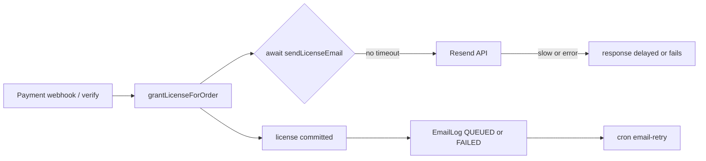

# FRPB Production Performance & Reliability Plan

> Scope: resolve slow loading / timeouts on the AWS EC2 `t3.micro` (1 GB RAM) production
> stack running `frpb-web` (Next.js 14.2.13 App Router) + Prisma + PostgreSQL.
> Deliverable mode: **architect** (plan only). Implementation happens in **code** mode.

---

## 1. Findings (evidence from the codebase)

| # | Area | File | Observation |
|---|------|------|-------------|
| 1 | Email | [`dispatch()`](frpb/apps/web/src/lib/email/resend.ts:1) | `await getResend().emails.send(...)` has **no timeout**. A hanging/rate-limited Resend call blocks the awaiter indefinitely. |
| 2 | Email | [`isEmailConfigured()`](frpb/apps/web/src/lib/email/resend.ts:21) | Only checks presence, not **format**. A stale/garbage key surfaces as `Invalid API key` at send time instead of being caught early. |
| 3 | Email | [`grantLicenseForOrder()`](frpb/apps/web/src/lib/payment/orders.ts:121) | **Awaits** `sendLicenseEmail` inside the payment verify + webhook path (line ~241). Under a mail outage this adds seconds to the payment response. |
| 4 | Caching | [`verifyLicenseCore()`](frpb/apps/web/src/lib/license/verify.ts:1) | Every verify does `findUnique(include: { plan, devices })` **plus** a `license.update` **plus** a `licenseDevice.count` — 3+ round trips per call, no cache, and an unconditional write on every request. |
| 5 | Caching | [`resolvePrismaUser()`](frpb/apps/web/src/lib/auth/user-identity.ts:44) | Two sequential `findUnique` queries (by `supabaseId`, then by normalized `email`) on every call. |
| 6 | Caching | [`rate-limit.ts`](frpb/apps/web/src/lib/rate-limit.ts:12) | Already has a correct **Upstash Redis + `MemoryKV` fail-open** pattern we can reuse for the license/user caches. |
| 7 | Prisma | [`prisma.ts`](frpb/apps/web/src/lib/prisma.ts:94) | Pool tuning exists (`connection_limit=5` for pooler, `connect_timeout=15`, `pool_timeout=20`) but `connection_limit=5` × 1 instance is fine; larger concern is local Postgres co-tenancy. |
| 8 | Runtime | [`ecosystem.config.cjs`](frpb/deploy/ecosystem.config.cjs:1) | PM2 fork mode, `instances: 1`, `max_memory_restart: 512M`, **no `NODE_OPTIONS`** heap cap → V8 assumes a large default heap and over-reserves against 1 GB. |
| 9 | Rendering | [`next.config.mjs`](frpb/apps/web/next.config.mjs:127) | `webpack.cache = false` in prod (affects **build** time, not runtime). No `optimizePackageImports` for icon/posthog barrels. |
| 10 | Security/Env | [`test-key.ts`](frpb/apps/web/src/lib/license/test-key.ts:1) | `FRPB-TEST-1234-5678` is accepted in **production** (Tier-1 exact match, all envs). |
| 11 | Infra | deploy runbook | PostgreSQL runs **on the same t3.micro** as Node, yet the app already targets **Supabase Postgres** via `DATABASE_URL`/`DIRECT_URL`. Local PG is likely redundant RAM pressure. |



---

## 2. Work Plan by Task

### Task 1 — Resend / Email configuration hardening
**Goal:** `RESEND_API_KEY` read from env, validated, and a mail failure can never block auth, checkout, or license delivery.

- **1.1** Add `RESEND_SEND_TIMEOUT_MS` (default `8000`) to [`resend.ts`](frpb/apps/web/src/lib/email/resend.ts:1) and wrap the send in a race/abort:
  ```ts
  const SEND_TIMEOUT_MS = Number(process.env.RESEND_SEND_TIMEOUT_MS ?? 8000);
  const controller = new AbortController();
  const timer = setTimeout(() => controller.abort(), SEND_TIMEOUT_MS);
  try {
    const { data, error } = await getResend().emails.send(
      { from, to, subject, html },
      { signal: controller.signal } // if SDK lacks signal, use Promise.race
    );
    ...
  } finally { clearTimeout(timer); }
  ```
  If the Resend SDK does not accept an `AbortSignal`, fall back to `Promise.race([send, timeoutReject])` — still guarantee the await resolves.
- **1.2** Strengthen [`isEmailConfigured()`](frpb/apps/web/src/lib/email/resend.ts:21) to validate the `re_` prefix + minimum length; return `false` (→ graded error, no throw) on malformed keys so we fail **fast and clear** instead of `Invalid API key` mid-flow.
- **1.3** Make the *user-facing* auth/checkout path non-blocking: in [`grantLicenseForOrder()`](frpb/apps/web/src/lib/payment/orders.ts:121), keep the license transaction committed first, then dispatch the email **without extending the HTTP response** (background via `waitUntil`-style deferral already used in [`pageview/route.ts`](frpb/apps/web/src/app/api/v1/analytics/pageview/route.ts:55), or a documented fire-and-forget with the EmailLog retry cron as backstop). The retry cron already exists (`retryFailedEmails`, `MAX_EMAIL_ATTEMPTS=5`, `EMAIL_RETRY_WINDOW_HOURS=48`).
- **1.4** Add a startup log line (non-secret) indicating whether email is configured, so ops can spot a missing key immediately.

**Acceptance:** with `RESEND_API_KEY` unset/invalid or the provider hanging, checkout + license verify return in normal time; the license is still granted; the failure is recorded in `EmailLog` and retried by cron.

---

### Task 2 — Caching strategy (Redis + in-memory fallback)
**Goal:** eliminate repeated DB round-trips for license verification and identity resolution.

- **2.1** Add a small cache module `src/lib/cache.ts` that reuses the [`getRedis()`](frpb/apps/web/src/lib/rate-limit.ts:12) pattern (Upstash REST, else in-memory `Map` with TTL, fail-open on store errors). Expose `cacheGet<T>`, `cacheSet(key, value, ttlSeconds)`, `cacheDel`.
- **2.2** Cache license verification in [`verify.ts`](frpb/apps/web/src/lib/license/verify.ts:1) / [`route.ts`](frpb/apps/web/src/app/api/v1/license/verify/route.ts:1):
  - Key: `lic:v1:{keySha256}:{hardwareId}` → serialized `{ status, planName, deviceLimit, expiresAt, bound }`.
  - TTL **45 s** (short enough that unbind/status changes converge; long enough to absorb polling bursts).
  - **Invalidate** the key on any mutation (unbind, `license.update`) so revocation is not masked.
- **2.3** Throttle the `lastVerifiedAt` write: only persist when `now - lastVerifiedAt > 60 s`, so steady-state polling becomes read-only (removes the unconditional write per verify).
- **2.4** Cache [`resolvePrismaUser()`](frpb/apps/web/src/lib/auth/user-identity.ts:44) by `email`/`supabaseId` with a 60 s TTL, invalidated in [`upsertPrismaUser()`](frpb/apps/web/src/lib/auth/user-identity.ts:82).
- **2.5** Confirm `.env.production` sets `UPSTASH_REDIS_REST_URL` + `UPSTASH_REDIS_REST_TOKEN` (already templated at [`env.production.example`](frpb/deploy/env.production.example:59)); document that without them the cache degrades to per-process memory (still correct, just not shared).

**Acceptance:** repeat license verify within TTL issues **0** DB reads; P95 verify latency drops; behavior identical with Redis absent (falls back to memory).

---

### Task 3 — Query / Prisma / Next.js memory optimization
**Goal:** reduce per-request and steady-state memory on 1 GB.

- **3.1** Prisma query shape in [`verify.ts`](frpb/apps/web/src/lib/license/verify.ts:1): replace `include: { devices: true }` with a narrow `select` + a bounded `licenseDevice.findMany({ where: { status: "ACTIVE" }, take: deviceLimit + 1 })` so we never hydrate an unbounded device list.
- **3.2** Keep pool tuning but make it explicit for a single small instance: `connection_limit=5` (already), `connect_timeout=15`; document that `DIRECT_URL` (5432) is **build/migrate only** and must never be used at runtime.
- **3.3** PM2 ([`ecosystem.config.cjs`](frpb/deploy/ecosystem.config.cjs:1)): add a bounded heap so V8 stops over-reserving:
  ```
  NODE_OPTIONS: "--max-old-space-size=384"
  ```
  and keep `max_memory_restart: "512M"` (leaves room for OS + Nginx). Do **not** enable cluster mode on t3.micro (2 processes would thrash); revisit on t3.small.
- **3.4** Next.js ([`next.config.mjs`](frpb/apps/web/next.config.mjs:1)): add `experimental.optimizePackageImports: ["lucide-react", "posthog-js"]` (tree-shakes icon/analytics barrels → smaller server + client bundles). `compress`, image formats, and cache headers are already optimal.
- **3.5** Reduce co-tenancy: since the app targets **Supabase Postgres**, stop the local PostgreSQL service on the EC2 box (or move it off-box) unless intentionally used as a cache. This is the single largest RAM win on t3.micro.
- **3.6** Rendering audit: keep `force-dynamic` only on mutating/auth routes ([`license/verify`](frpb/apps/web/src/app/api/v1/license/verify/route.ts:1), checkout, webhooks). Marketing/landing/brand/free-tool pages must stay **static/ISR** (they are already server components with no DB). Add `export const revalidate` where content is time-stable.

**Acceptance:** RSS on the box stays under the t3.micro ceiling during a cold boot; `next build` unchanged; no dynamic route accidentally becomes static.

---

### Task 4 — Actionable infra + env checklist
**Goal:** a copy-paste remediation list for the operator.

**Infra**
- [ ] Resize EC2 `t3.micro` → **`t3.small`** (2 GB) — stop instance, change type, start; retains Elastic IP.
- [ ] Interim: add **2 GB swap** (`fallocate -l 2G /swapfile && chmod 600 && mkswap && swapon`) before resizing to survive cold-boot spikes.
- [ ] Verify **Node 20.x** and that only `frpb-web` runs under PM2 (`pm2 list`).
- [ ] If PostgreSQL still runs locally: `systemctl stop postgresql && systemctl disable postgresql` (Supabase is the datastore).
- [ ] Enable **CloudFront** in front of Nginx for static/`_next/static` caching.

**Env cleanup (`apps/web/.env.production`, `chmod 600`)**
- [ ] `RESEND_API_KEY` present and starts with `re_`; set `RESEND_FROM_EMAIL`/`EMAIL_FROM` to a **verified Resend domain** sender (an unverified domain yields `Invalid API key`/403-style failures).
- [ ] `UPSTASH_REDIS_REST_URL` + `UPSTASH_REDIS_REST_TOKEN` set (enables shared cache).
- [ ] `NODE_OPTIONS=--max-old-space-size=384` in PM2 env.
- [ ] Remove any test/placeholder secrets from prod.

**Test-key lockdown (security)**
- [ ] `FRPB-TEST-1234-5678` is currently accepted in production. Either:
  - **(a)** require `ALLOW_DEV_TEST_KEYS=true` for **all** test keys incl. the exact master key, or
  - **(b)** move the master key to `MASTER_TEST_LICENSE_KEY` env (unset in prod ⇒ feature off).
- [ ] Add a startup warning if `ALLOW_DEV_TEST_KEYS=true` under `NODE_ENV=production`.

---

## 3. Proposed File Change Map

| File | Change |
|------|--------|
| [`src/lib/email/resend.ts`](frpb/apps/web/src/lib/email/resend.ts:1) | Send timeout + abort/race, `re_` key validation, clearer failure logging |
| [`src/lib/payment/orders.ts`](frpb/apps/web/src/lib/payment/orders.ts:241) | Dispatch email off the HTTP response path (background + cron backstop) |
| `src/lib/cache.ts` (**new**) | Redis + memory TTL cache (mirrors `rate-limit.ts`) |
| [`src/lib/license/verify.ts`](frpb/apps/web/src/lib/license/verify.ts:1) | Narrow `select`, cache read/write, throttle `lastVerifiedAt` |
| [`src/app/api/v1/license/verify/route.ts`](frpb/apps/web/src/app/api/v1/license/verify/route.ts:1) | Invalidate cache on failure/unbind; keep `force-dynamic` |
| [`src/lib/auth/user-identity.ts`](frpb/apps/web/src/lib/auth/user-identity.ts:44) | Cache `resolvePrismaUser`, invalidate in `upsertPrismaUser` |
| [`src/lib/license/test-key.ts`](frpb/apps/web/src/lib/license/test-key.ts:1) | Gate master key behind env/`ALLOW_DEV_TEST_KEYS` |
| [`deploy/ecosystem.config.cjs`](frpb/deploy/ecosystem.config.cjs:1) | `NODE_OPTIONS=--max-old-space-size=384` |
| [`next.config.mjs`](frpb/apps/web/next.config.mjs:1) | `optimizePackageImports` |
| [`deploy/env.production.example`](frpb/deploy/env.production.example:1) | Add `RESEND_SEND_TIMEOUT_MS`, `NODE_OPTIONS`, test-key notes |

---

## 4. Suggested Execution Order (for code mode)
1. Task 1 (email timeout + key validation + non-blocking dispatch).
2. Task 2 (`cache.ts`, license + identity caching, write throttling).
3. Task 3 (query shape, PM2 heap, `optimizePackageImports`, local PG removal).
4. Task 4 (infra + env checklist, test-key gating).
5. `corepack pnpm --filter @frpb/web exec tsc --noEmit` + `pnpm --filter @frpb/web test` after each task.
6. Commit + push (including the still-uncommitted AWS EC2 deploy artifacts).
