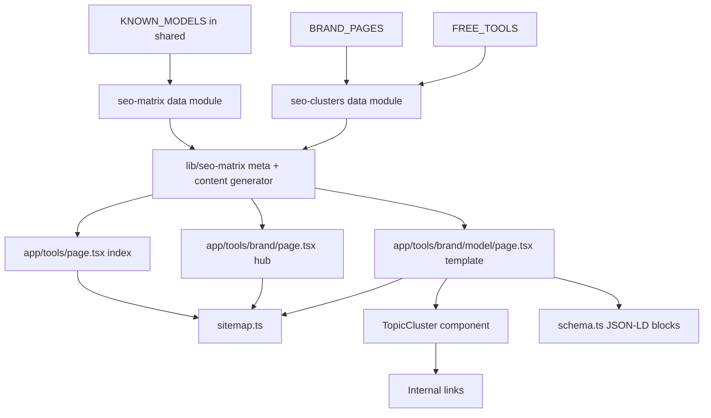

# FRPB — SEO Scaling Architecture (Programmatic SEO Playbook)

## 1. Objective

Dominate Google positions 1–3 for three query families:

1. **Core / brand:** frp bypass tool, frp tool, frp b, frpb, android lock removal tool.
2. **Device / model long-tail (programmatic):** brand + model matrix
   (e.g. `samsung a12 frp bypass`, `vivo y20 lock removal`, plus Xiaomi, Realme,
   Oppo, OnePlus, Tecno, Infinix, Huawei, Motorola, Google, Nothing, realme…).
3. **Service / utility:** Virtual Location, Data Eraser, Phone Transfer, WhatsApp Transfer.

Delivered as a **hub-and-spoke programmatic SEO engine** on top of the existing
Next.js App Router foundation — no new frameworks, full reuse of the current
content/config/schema idioms.

## 2. Verified Foundation (audit result)

| Concern | Current state | Reuse / extend |
|---|---|---|
| Canonical origin | [`SITE_URL`](frpb/apps/web/src/lib/seo.ts:8) = `NEXT_PUBLIC_APP_URL ?? https://frpb.in`; root `metadataBase` set | Single source — keep |
| Per-route metadata | [`pageMetadata()`](frpb/apps/web/src/lib/seo.ts:71) builds title/desc/canonical/OG/Twitter | Extend with a matrix generator |
| Sitemap | [`sitemap.ts`](frpb/apps/web/src/app/sitemap.ts:11) native route, spreads `BRAND_PAGE_ROUTES`, `FREE_TOOL_ROUTES`, `UNLOCK_TOOL_ROUTES`, `BLOG_POSTS` | Append model + hub routes |
| Robots | `robots.ts` allow-all + sitemap + host | Keep (verify disallow list) |
| JSON-LD builders | [`schema.ts`](frpb/apps/web/src/lib/schema.ts:53) — SoftwareApplication, Organization, WebSite, Product, FAQPage, BreadcrumbList, HowTo, Blog/BlogPosting | Reuse all; pass route context |
| Templates | [`BrandLandingPage`](frpb/apps/web/src/components/brand-landing-page.tsx:68), [`UnlockLandingPage`](frpb/apps/web/src/components/unlock-landing-page.tsx), [`FreeToolLandingPage`](frpb/apps/web/src/components/free-tool-landing-page.tsx:83) | Reuse patterns; add model template |
| Data sources | [`KNOWN_MODELS`](frpb/packages/shared/src/android-models.ts:37) + [`brandFromModel()`](frpb/packages/shared/src/android-models.ts:127) + [`chipsetFromModel()`](frpb/packages/shared/src/android-models.ts:167); [`BRAND_PAGES`](frpb/apps/web/src/config/brand-pages.ts:69); [`FREE_TOOLS`](frpb/packages/shared/src/free-tools.ts:93) | Derive matrix from these |
| Existing `/tools` route | **None** (confirmed ENOENT) | Clean addition, zero duplicate-route risk |

**Keyword-field shapes to respect (critical for a shared generator):**
- `BrandPageContent.keywords` → `string[]`
- `UnlockToolMeta.keywords` → `string[]`
- `FreeToolMeta.keywords` → **comma-joined `string`** (split at route level)

## 3. Architecture Overview



## 4. File Plan

### New — shared / data
- `apps/web/src/data/seo-matrix.ts` — typed device matrix derived from `KNOWN_MODELS`
  (brand slug, brand label, model slug, model label, chipset, intent, path).
- `apps/web/src/data/seo-clusters.ts` — keyword maps + cluster link sets for brands,
  models and utilities; helper selectors (`relatedModels`, `utilityCrossLinks`, `clusterForBrand`).

### New — lib
- `apps/web/src/lib/seo-matrix.ts` — pure generators:
  `modelMetaTitle()`, `modelMetaDescription()`, `modelKeywords()`,
  `buildModelContent()` (produces a `BrandPageContent`-compatible object),
  `parseModelSlug()` (slug → brand + model + intent), `modelJsonLdContext()`.

### New — components
- `apps/web/src/components/model-landing-page.tsx` — model spoke template
  (breadcrumb, H1, spec strip, features, steps, FAQ, TopicCluster, 4 JSON-LD blocks).
- `apps/web/src/components/seo/topic-cluster.tsx` — reusable cross-link widget
  (exact-match anchors, `aria-label`, server component, no client JS).

### New — routes
- `apps/web/src/app/tools/page.tsx` — tools index (all brands + utilities hub).
- `apps/web/src/app/tools/[brand]/page.tsx` — brand hub, `generateStaticParams`.
- `apps/web/src/app/tools/[brand]/[model]/page.tsx` — model spoke,
  `generateStaticParams` + `dynamicParams = false`.

### Edited
- `apps/web/src/app/sitemap.ts` — append model routes + tool hub routes.
- `apps/web/next.config.*` or `middleware.ts` — 308 aliases for legacy utility paths
  + host canonicalisation (verify exact filenames in Code mode first).

## 5. URL / Route Patterns

| Type | Pattern | Example |
|---|---|---|
| Tools index | `/tools` | `/tools` |
| Brand hub | `/tools/[brand]` | `/tools/samsung` |
| Model spoke | `/tools/[brand]/[model]-[intent]` | `/tools/samsung/a12-frp-bypass` |
| Model spoke | `/tools/[brand]/[model]-[intent]` | `/tools/vivo/y20-lock-removal` |

- `[model]` segment = `<model-slug>-<intent>`; intents: `frp-bypass`, `lock-removal`.
- Each model emits **two** intent variants; `parseModelSlug()` splits the suffix.
- `dynamicParams = false` guarantees only pre-built, sitemap-listed URLs are servable
  → no crawlable parameters, no duplicate content.
- Invalid slugs → `notFound()`.

## 6. Meta Title / Description Generator (Hack 2)

```txt
Title:       [Brand] [Model] FRP Bypass Tool 2026 — One-Click Unlock | FRPB
Lock removal:[Brand] [Model] Lock Removal Tool 2026 — Remove Screen Lock | FRPB
Description: Remove FRP / screen lock on the [Brand] [Model] in about 5 minutes.
             One-click USB unlock via [chipset] mode — free Windows tool, no data loss.
```
- Front-loads brand + model + intent in H1, `<title>`, OpenGraph, Twitter (via `pageMetadata`).
- Length-guarded (≤60 char title target) inside the generator.
- Keywords = model × intent × brand × chipset cross-product, deduped.

## 7. Schema Coverage Matrix (Hack 7 & 14)

| Page | SoftwareApplication | FAQPage | BreadcrumbList | HowTo |
|---|---|---|---|---|
| `/tools` | ✓ brand=FRPB | ✓ | ✓ | — |
| `/tools/[brand]` | ✓ module name | ✓ | ✓ | ✓ |
| `/tools/[brand]/[model]` | ✓ e.g. `FRPB Samsung A12 Lock Removal Module` | ✓ | ✓ | ✓ |
| Utility spokes | existing 3 blocks | ✓ | ✓ | — |

- `softwareApplicationSchema({ path, name, description })` supplies per-route `url` + module name.
- Every section opens with a direct answer in its first 2 sentences (snippet + AI-overview bait).

## 8. Topic Clusters & Internal Linking (Hack 4, 5, 12)

- `TopicCluster` renders: sibling models (same brand), brand hub, sibling intents,
  and 2–4 utility cross-links with **exact-match anchors**
  (`samsung frp tool`, `android lock removal tool`, `whatsapp transfer`, `phone transfer`).
- Utility spokes cross-link: WhatsApp Transfer → Phone Transfer → Data Eraser → Virtual Location.
- Brand hubs link down to every model spoke; spokes link back up (hub-and-spoke).

## 9. Canonical / Robots / Sitemap Guardrails

- Single canonical per URL via `pageMetadata` `alternates.canonical`.
- `sitemap.ts` lists only canonical, statically-generated URLs, prioritised:
  - model spokes `0.6` / monthly, brand hubs `0.7` / weekly, `/tools` `0.7` / weekly.
- Legacy utility aliases use **308 redirects**, never duplicate pages.
- Optional host normalisation (non-www → www) + HSTS in middleware — flagged as opt-in
  to avoid destabilising the existing Supabase auth middleware.

## 10. Anti-Thin-Content Guardrails

1. Every model page carries real model-specific facts (chipset, mode, key combo via
   `manualGuideForModel`) — not templated boilerplate alone.
2. Distinct H1/meta/description per intent.
3. Self-canonical on every variant; no cross-canonicalising spokes.
4. `dynamicParams = false` — no infinite URL space.
5. Matrix capped to the curated `KNOWN_MODELS` set (quality over quantity).

## 11. Implementation Phases

1. **Data foundation** — `seo-matrix.ts` + `seo-clusters.ts`.
2. **Generators** — `lib/seo-matrix.ts` (meta + content + slug parsing).
3. **Components** — `topic-cluster.tsx` + `model-landing-page.tsx`.
4. **Routes** — `/tools`, `/tools/[brand]`, `/tools/[brand]/[model]` with `generateStaticParams`.
5. **Wiring** — sitemap + utility aliases + schema pass.
6. **Verify** — `corepack pnpm --filter @frpb/web exec next build`; confirm SSG output,
   route count, zero TS errors, no bundle regression; produce audit report.

## 12. Verification Checklist

- [ ] `next build` succeeds with zero TS/ESLint errors.
- [ ] All matrix routes appear as static (○/●) in the build output.
- [ ] `/sitemap.xml` includes every model + hub URL with correct priorities.
- [ ] Rich Results test passes for SoftwareApplication, FAQPage, BreadcrumbList, HowTo.
- [ ] No duplicate routes; legacy utility paths 308 to a single canonical.
- [ ] No bundle-size regression on the marketing entry.
